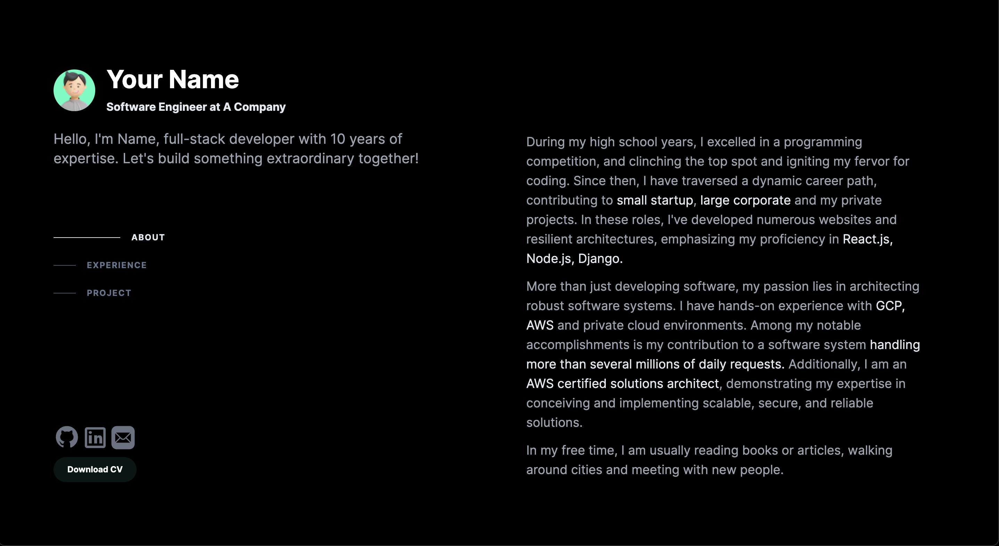

### Overview

Minimal portfolio website built with Next.js and Tailwind. Demo at https://portfolio-frontend-v2-kappa.vercel.app/



### Project Structure

- `app/: Application-specific code and utilities for overall behavior management.`
- `components/: Reusable React components promoting code reusability and maintainability.`
- `public/: Serves static assets like images, fonts, publicly accessible files.`
- `constants/: Constants files like messages, interfaces.`

## Getting Started

1. **Copy environment variables:**

```bash
cp .env.example .env.local
```

2. **Start container:**

```bash
docker compose up -d
```

3. **The application will be accessible at:**

```bash
http://localhost:3000
```

## Deployment

Any commit to the main branch is automatically deployed into production using CI-CD. Initiate a merge to the development branch beforehand for preview deployment.

## Feedback and Issues

If you encounter any issues or have suggestions for improvement, please feel free to create an issue or pull request.
